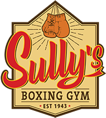

# Brand Guidelines

**Status:** Logo-locked (v1.1)  
**Source of truth logo:** [`assets/sullys-logo-primary.png`](./assets/sullys-logo-primary.png)

---

## Brand Essence

**Sully's Boxing Gym — EST 1943** is Canada's oldest boxing club: a community hub where boxing develops character and leadership — physical, mental, and emotional fitness inside principles of respect.

**Manifesto (equal weight — always together):**

1. Boxing is the engine  
2. People are the purpose  
3. Character is the legacy  

**Promise:** We don't lower standards — we raise people.  
**Heritage line:** Est. 1943 — earned, not invented.  
**Public site:** [https://www.sullysboxinggym.com](https://www.sullysboxinggym.com)

**Personality:** Confident · Direct · Inclusive · Relentless · Respectful · Heritage-proud · Stewardship-minded  

**Not:** Bro-toxic · Cartoonish · Clinical hospital · Purple tech startup · Generic lifestyle branding that ignores this mark  

Full narrative, cascade, programs, and culture standards: [Vision & Aesthetic](./04-vision-aesthetic.md).

### Legacy names (editorial — rights review required)
Storytelling may reference Deacon Allen, Earl “Sully” Sullivan, Joe Manteiga, Danielle Monteiga, Phil Pereira, and gym-associated legends (e.g. Chuvalo, Ali, Lewis) — only with accurate claims and cleared media. See [Legacy Experience](../02-domain/20-legacy-experience.md).

---

## Official Logo

### Primary mark
Vertical shield / plaque badge containing:

1. Vintage boxing gloves (hanging by laces) with sunburst rays at the peak  
2. **Sully's** in bold red script with dark outline / raised effect  
3. **BOXING GYM** in dark brown all-caps  
4. **EST 1943** flanked by two red five-point stars  

### Colors in the mark (approx. extract — refine with brand owner eyedrop)

| Role | Approx hex | Use |
|------|------------|-----|
| Cream field | `#F3E6C8` | Logo interior; light surfaces; marketing paper feel |
| Classic red | `#C82026` | Script wordmark; stars; primary brand accent |
| Chocolate brown | `#3A2418` | Borders, “BOXING GYM”, EST line, outlines |
| Glove tan | `#C4A06A` | Illustration only; optional secondary warm accent |
| Glove shadow brown | `#5C3A24` | Illustration depth |

Exact values should be confirmed from the master vector file when available. Until then, use the PNG as visual authority and these tokens as working digital values.

### Clear space & sizing
- Clear space ≥ **½ glove height** on all sides  
- Minimum digital width: **96px** (full badge); for tiny spaces use **gloves-only** or wordmark derivative (to be created)  
- Never stretch, skew, recolor, add drop shadows, or place on busy photos without a scrim  
- Do not replace script with another cursive  

### Backgrounds
| Background | Treatment |
|------------|-----------|
| Cream / light | Full color badge as-is |
| Dark charcoal (app default) | Full color badge; ensure cream field remains readable |
| Photography | Badge on soft dark or cream plate; never raw on mid-tone clutter |
| Single-color print | Request knockout / one-color master from brand owner |

### App icon / favicon
- Prefer **gloves + peak** crop or simplified shield  
- Must remain legible at 29×29  
- Do not use full “Sully's” script alone at favicon size  

### Forbidden
- Recoloring script to neon / purple / lime  
- Separating gloves from badge without approved lockup  
- Adding “Performance Platform” into the badge artwork  
- Animating the logo with bounce/spin gimmicks (subtle fade/scale only)

---

## Digital Product Visual Strategy

**Heritage mark + modern performance UI.**

- **Marketing / onboarding / empty heroes:** lean into cream, badge, EST 1943, photography of the real gym  
- **Daily member & staff apps:** dark charcoal canvases for gym-floor contrast and focus, with **classic red** as the primary CTA/accent and **cream** for elevated text/highlights  
- **Command Center / Gym TV:** dark ops boards; badge as watermark or corner lockup; red for live/alert energy; cream for key numerals  

This avoids fighting the logo (warm heritage) while keeping check-in/roster readability under fluorescent light.

---

## Typography

| Role | Direction | Notes |
|------|-----------|-------|
| Brand display | Script matching **Sully's** (licensed twin or custom) | Use sparingly: marketing H1, rank celebrations, Fight Night titles |
| Athletic display | Condensed sans (e.g. Bebas-like / Impact-adjacent carefully) | Ranks, TV scores — not body |
| UI headline | Strong grotesque (Satoshi / General Sans / similar) | Section titles |
| UI body | Same grotesque family, regular/medium | Data, forms |
| Heritage secondary | Classic bold caps reminiscent of **BOXING GYM** | Small labels: EST, program chips |

Never use Inter/Roboto/Arial as brand voice. Script is **emotion**, not **UI density**.

---

## Voice & Tone

| Context | Tone |
|---------|------|
| Check-in | Crisp confirmation |
| Missed payment | Helpful, non-shaming |
| Youth | Encouraging, plain language |
| Owner alerts | Factual, prioritized |
| Marketing | Heritage + aspiration; honest |
| Errors | Human, solvable |

**Prefer:** train, progress, team, show up, sharp, ready, earned, legacy  
**Avoid:** crush your enemies (youth), detox, guru, synergy, “disrupt”  

Optional heritage microcopy (sparingly): “Since 1943” on about/marketing — not on every toast.

---

## Photography & Imagery

- Real gym: gloves, ring, sweat, community, youth (with consent)  
- Warm tungsten / practical gym light complements cream/red  
- Avoid stock handshake corporate and generic neon purple gym tropes  
- Fight night can be louder; daily app calmer  

---

## Brand Test

If you remove the nav and the first marketing viewport could belong to any gym SaaS, branding is too weak — lead with the **Sully's badge** or unmistakable **Sully's** script as a hero-level signal.

---

## Localization

- EN primary; FR Canadian for compliance surfaces  
- Do not translate the wordmark **Sully's**  

---

## Partner / Franchise Marks (Future)

- Location secondary: `Sully's · [City]` outside the badge  
- Core badge locked; local accent limited  
- Franchise cannot recolor the script red or alter EST 1943  

---

## Asset Checklist for Engineering

- [ ] Master SVG/PDF from brand owner  
- [ ] PNG full badge @1x/2x/3x (this file is interim)  
- [ ] Gloves-only mark  
- [ ] Horizontal lockup (if needed for nav height)  
- [ ] Monochrome / knockout versions  
- [ ] App icon set  

---

## Change Log

- **2026-08-07:** Official logo received; palette and usage locked to heritage badge (cream / classic red / chocolate brown / EST 1943).
