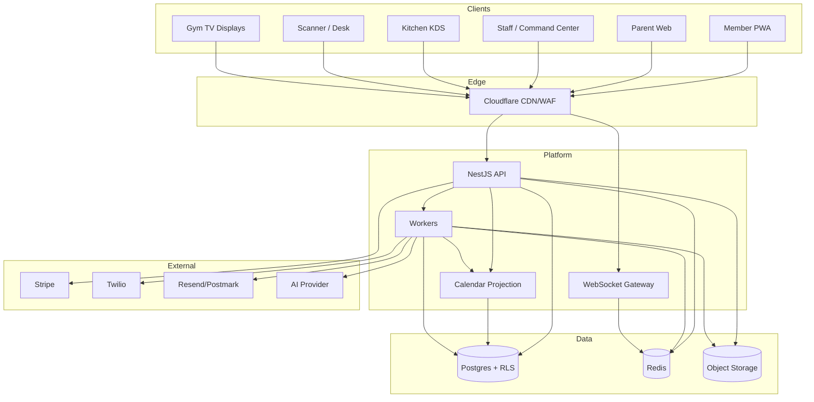
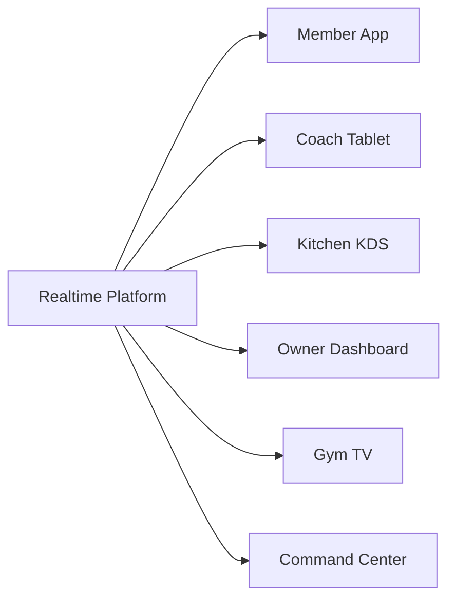
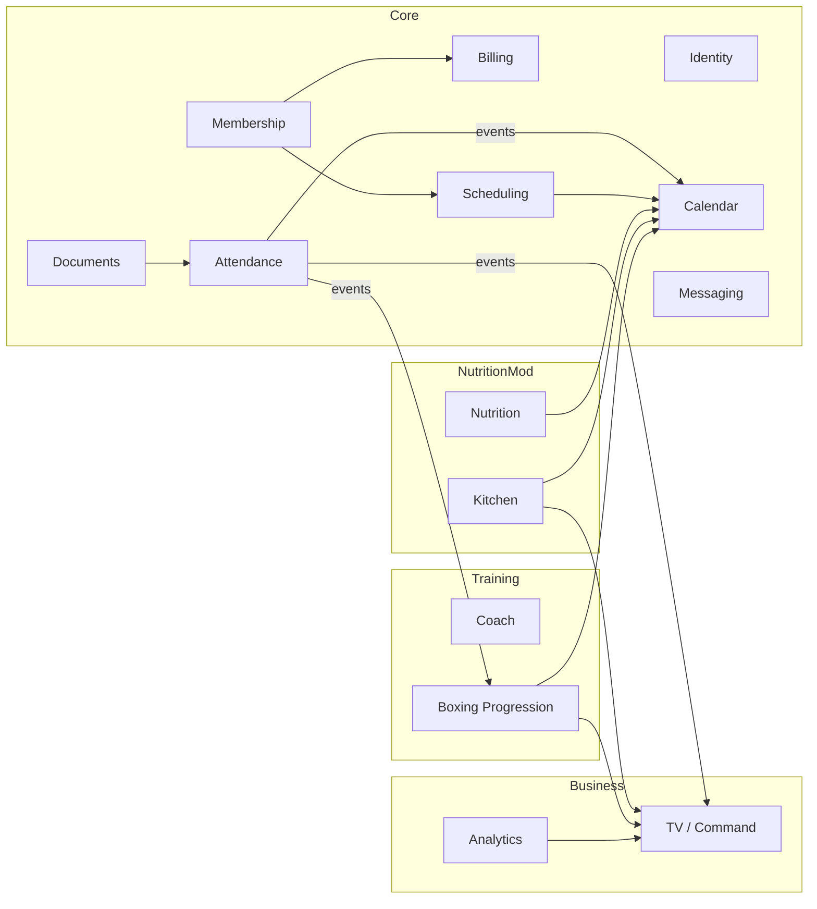
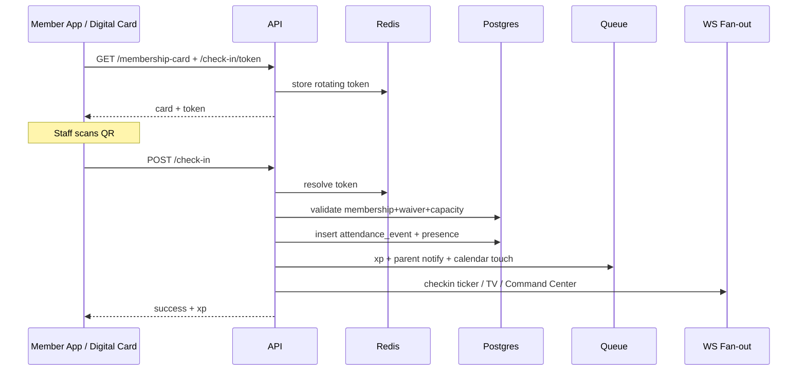
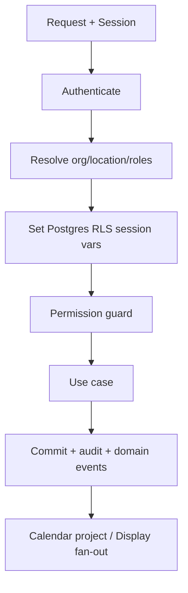

# Architecture Diagrams

## Context Diagram

```mermaid
flowchart TB
  subgraph Clients
    M[Member PWA]
    P[Parent Web]
    S[Staff / Command Center]
    K[Kitchen KDS]
    SC[Scanner / Desk]
    TV[Gym TV Displays]
  end

  subgraph Edge
    CF[Cloudflare CDN/WAF]
  end

  subgraph Platform
    API[NestJS API]
    W[Workers]
    WS[WebSocket Gateway]
    CAL[Calendar Projection]
  end

  subgraph Data
    DB[(Postgres + RLS)]
    REDIS[(Redis)]
    OBJ[(Object Storage)]
  end

  subgraph External
    STRIPE[Stripe]
    SMS[Twilio]
    EMAIL[Resend/Postmark]
    AI[AI Provider]
  end

  M --> CF
  P --> CF
  S --> CF
  K --> CF
  SC --> CF
  TV --> CF
  CF --> API
  CF --> WS
  API --> DB
  API --> REDIS
  API --> OBJ
  API --> STRIPE
  API --> CAL
  CAL --> DB
  W --> DB
  W --> REDIS
  W --> EMAIL
  W --> SMS
  W --> AI
  W --> OBJ
  W --> CAL
  API --> W
  WS --> REDIS
```

## Connected Facility (Differentiation)

```mermaid
flowchart LR
  RT[Realtime Platform]
  RT --> APP[Member App]
  RT --> COACH[Coach Tablet]
  RT --> KDS[Kitchen KDS]
  RT --> OWN[Owner Dashboard]
  RT --> TV[Gym TV]
  RT --> CC[Command Center]
```

## Modular Monolith Internals

```mermaid
flowchart LR
  subgraph Core
    ID[Identity]
    DOC[Documents]
    MEM[Membership]
    BIL[Billing]
    CAL[Calendar]
    SCH[Scheduling]
    ATT[Attendance]
    MSG[Messaging]
  end

  subgraph Training
    COA[Coach]
    PROG[Boxing Progression]
  end

  subgraph NutritionMod
    NUT[Nutrition]
    KIT[Kitchen]
  end

  subgraph Business
    AN[Analytics]
    DISP[TV / Command]
  end

  ATT -->|events| PROG
  ATT -->|events| CAL
  ATT -->|events| DISP
  MEM --> BIL
  DOC --> ATT
  MEM --> SCH
  SCH --> CAL
  NUT --> CAL
  KIT --> CAL
  KIT --> DISP
  PROG --> CAL
  PROG --> DISP
  AN --> DISP
```

## Check-In Sequence

```mermaid
sequenceDiagram
  participant App as Member App / Digital Card
  participant API as API
  participant Redis as Redis
  participant DB as Postgres
  participant Q as Queue
  participant RT as WS Fan-out

  App->>API: GET /membership-card + /check-in/token
  API->>Redis: store rotating token
  API-->>App: card + token
  Note over App: Staff scans QR
  App->>API: POST /check-in
  API->>Redis: resolve token
  API->>DB: validate membership+waiver+capacity
  API->>DB: insert attendance_event + presence
  API->>Q: xp + parent notify + calendar touch
  API->>RT: checkin ticker / TV / Command Center
  API-->>App: success + xp
```

## Multi-Tenant Request Path

```mermaid
flowchart TD
  A[Request + Session] --> B[Authenticate]
  B --> C[Resolve org/location/roles]
  C --> D[Set Postgres RLS session vars]
  D --> E[Permission guard]
  E --> F[Use case]
  F --> G[Commit + audit + domain events]
  G --> H[Calendar project / Display fan-out]
```
