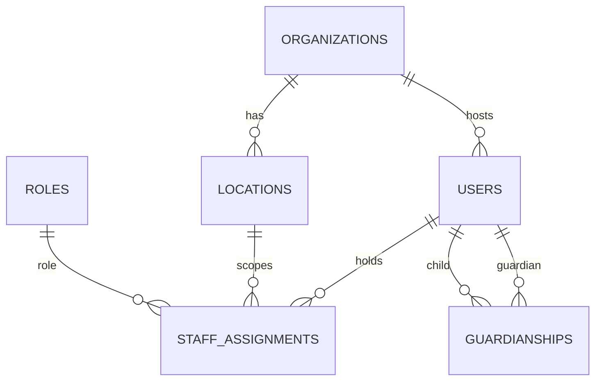
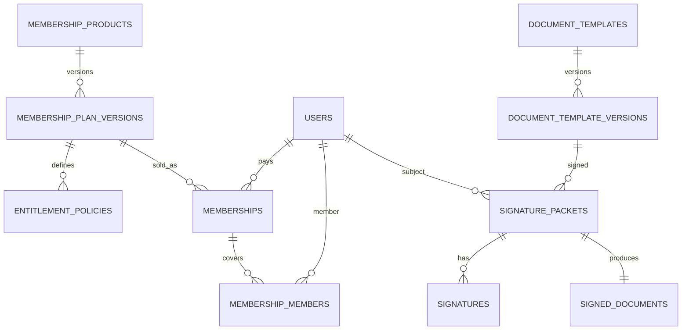
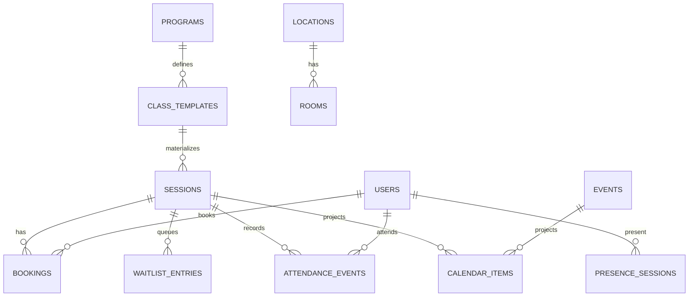
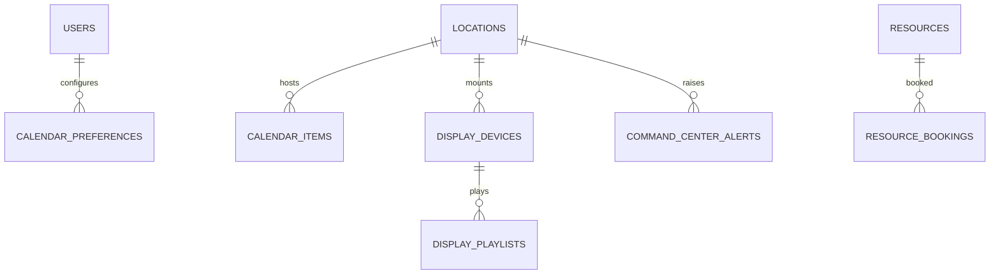
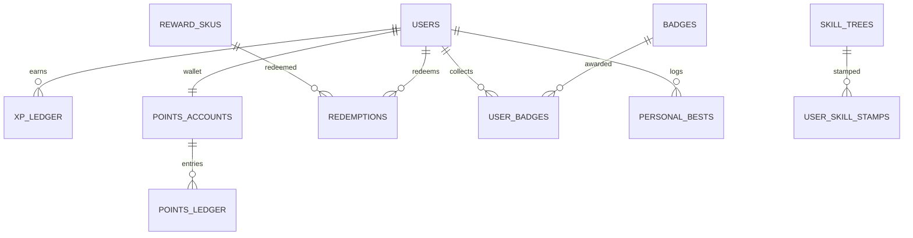
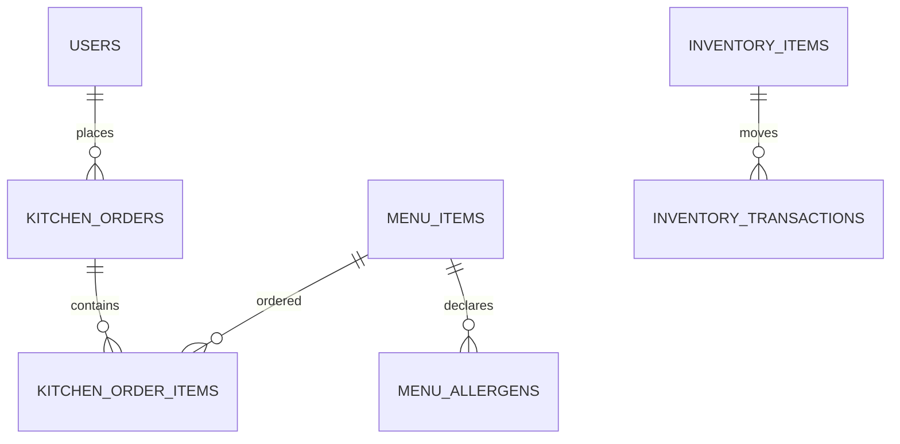

# Entity Relationship Overview

## Core Tenancy & People

## Membership & Compliance

## Scheduling & Attendance

## Calendar & Displays

## Gamification Ledgers

## Kitchen

## Notes

- Full physical schemas evolve in migrations; this is the conceptual map.  
- JSONB policy documents attach to plan versions and XP rules for extensibility.  
- All tenant tables include `organization_id` (omitted in diagrams for clarity).  
- Calendar items may be materialized or a secured view — either way, one hub API.