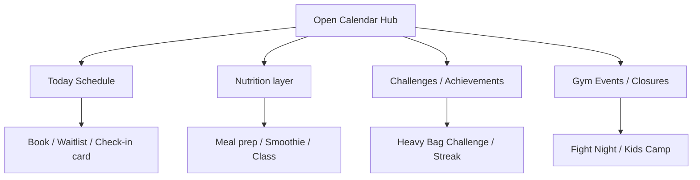
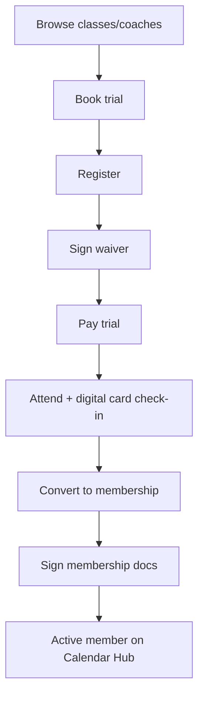
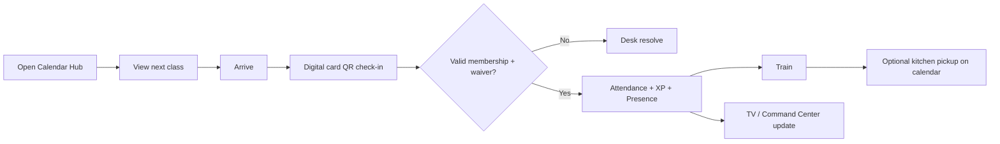
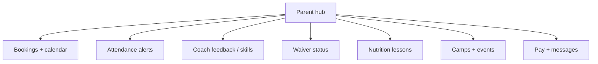
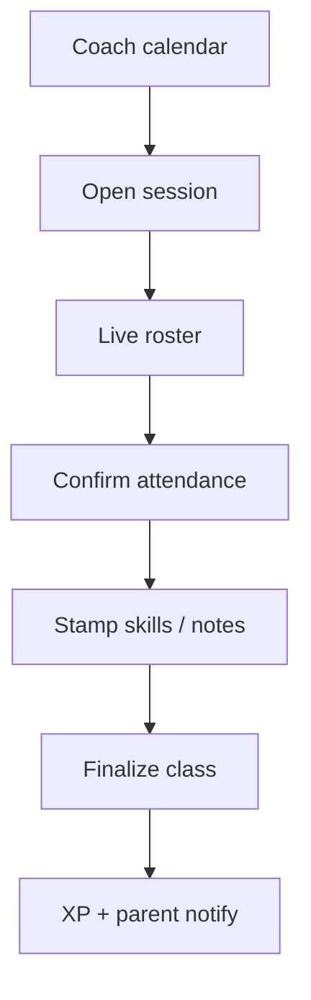
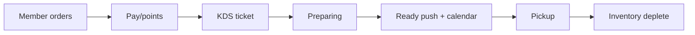
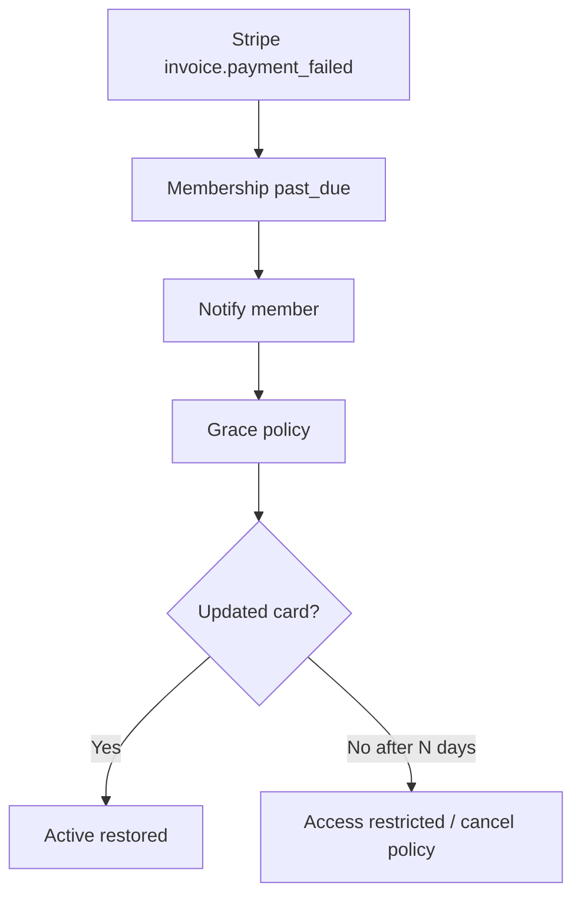
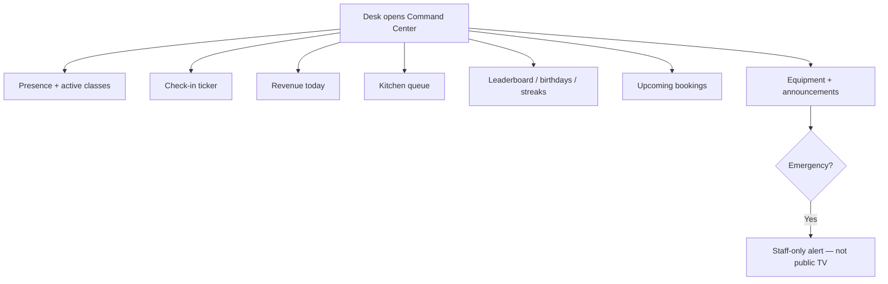

# Core Workflows

## Member Calendar Hub Day

## Guest → Member

## Class Day — Member

## Parent Youth Loop

## Coach Run Class

## Kitchen Pre-Order

## Payment Failure Recovery

## Command Center Morning

